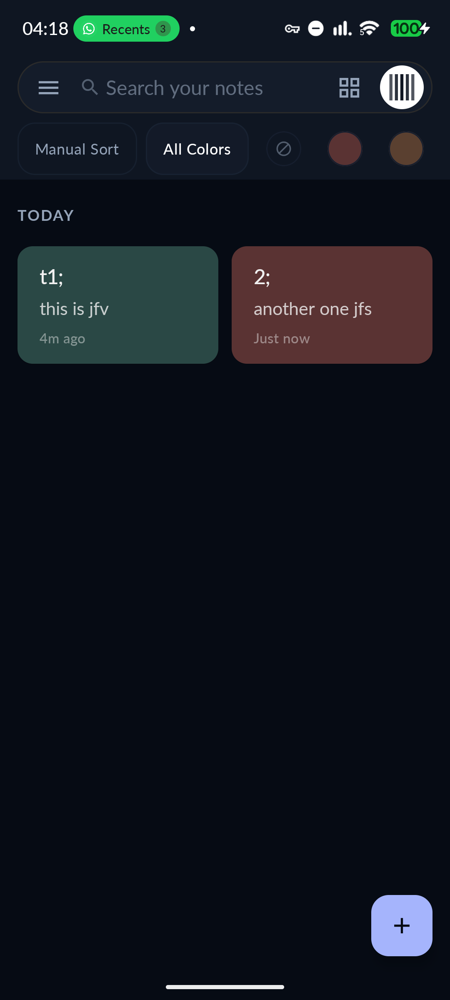
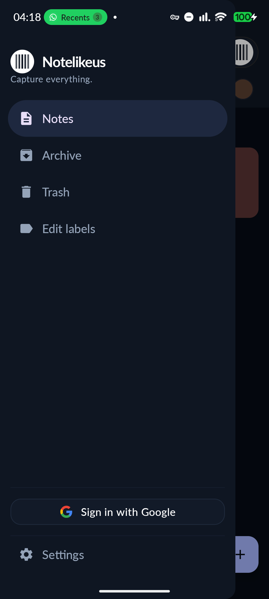
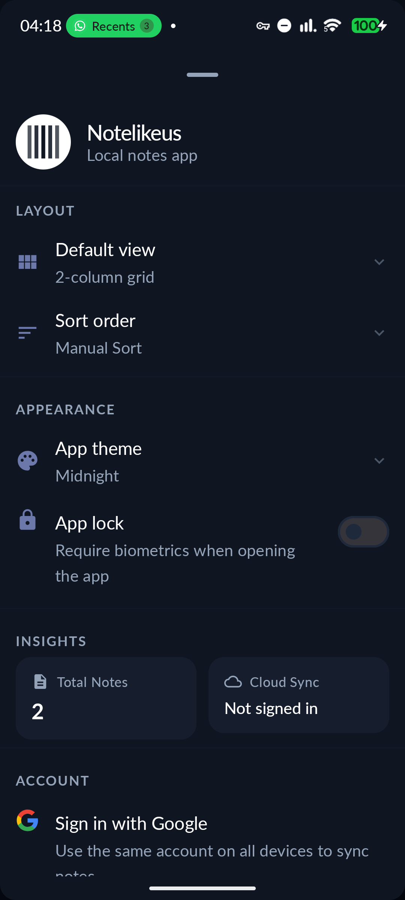
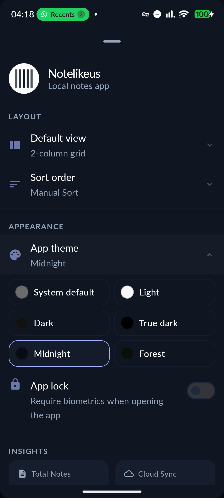
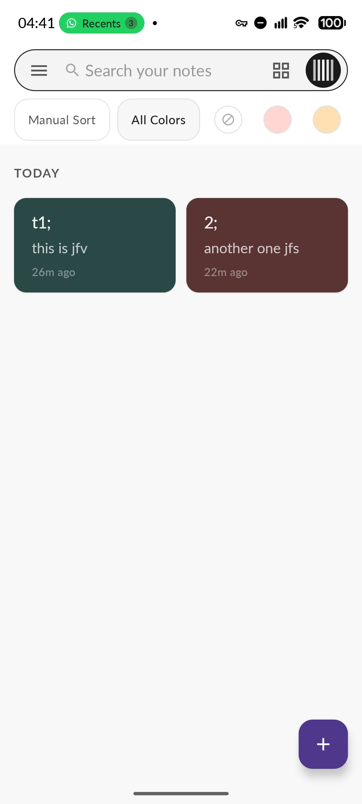
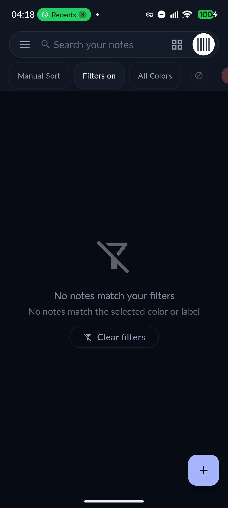
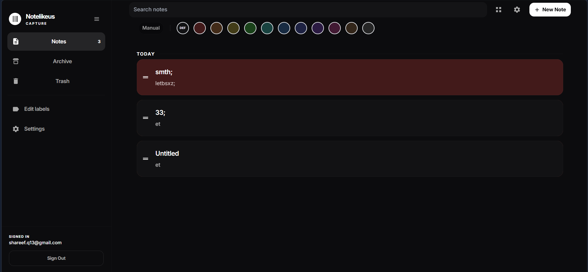

# Notelikeus

A Google Keep–style notes app for **Android** and **web** (PWA). Notes are stored locally with SQLCipher encryption on Android (localStorage on web). Google Sign-In is required; auto-sync to your Firebase account can be toggled in settings.

## 🌟 Technical Highlights

- **Native Android Engineering**: Leveraging the full Jetpack suite (Compose, Hilt, Room, WorkManager, Glance) to deliver a fluid, 60fps user experience.
- **Privacy-Centric Architecture**: 
    - Implemented **SQLCipher** for military-grade at-rest encryption of the local SQLite database.
    - Integrated **Biometric Auth** and custom secure-gate logic for sensitive data protection.
- **Distributed System Sync**: 
    - Designed an **offline-first** synchronization engine using Firestore's real-time listeners.
    - Conflict resolution strategy optimized for low-latency updates across mobile and web clients.
- **Enterprise-Grade UI/UX**: 
    - Design system built on **Material 3**, featuring dynamic color support and adaptive layouts for foldable and large-screen devices.
    - Custom **Rich Text Engine** supporting Markdown-lite syntax with a high-performance WYSIWYG editor.

| Feature | Web |
|---------|-----|
| Notes, labels, checklists, colors | Yes |
| Archive, trash, pin, search, filters | Yes |
| Multi-select + bulk actions | Yes |
| Swipe actions + undo toasts | Yes |
| Manual reorder (list view) | Yes |
| Date-grouped sections (Today, Yesterday) | Yes |
| Recent search history | Yes |
| Smart editor (auto bullets, list continue) | Yes |
| Google Sign-In + real-time Firestore sync | Yes |
| Guest mode (local only) | No — Google sign-in required |
| JSON backup import/export | Yes |
| Reminders | Browser + service worker notifications |
| Offline mode + install prompt | Yes |
| Per-note lock | Unlock gate (no biometric on web) |

```bash
cd web
npm install
cp .env.example .env   # set VITE_FIREBASE_APP_ID from Firebase Console
npm run dev            # http://localhost:5173
npm run build
```

Deploy from repo root:

```bash
firebase deploy --only hosting:notelike,firestore:rules
```

See [`web/README.md`](web/README.md) for full PWA setup and architecture notes.

## Features

- **Notes** — titles, rich text (bold, italic, links, bullets), checklists, colors, and labels
- **Organization** — pin, archive, trash, search, color/label filters, list/grid layout, drag-to-reorder (list view)
- **Security** — SQLCipher-encrypted Room database, per-note biometric lock, optional app-wide lock
- **Cloud sync** — optional Firestore sync when signed in with Google (Spark/free tier friendly; text only)
- **Reminders** — date/time notifications that open the note
- **Backup** — export and import notes as JSON from Settings
- **Widget** — home screen glance widget with pinned/recent notes
- **Undo** — archive, trash, and delete actions on the main list and in the editor

## Tech stack

| Layer | Choice |
|-------|--------|
| UI | Jetpack Compose, Material 3 |
| DI | Hilt |
| Data | Room + SQLCipher |
| Cloud | Firebase Auth + Firestore |
| Settings | DataStore Preferences |
| Widget | Glance |
| Tests | JUnit, Turbine, MockK, Compose UI Test |

## Requirements

- Android 8.0+ (API 26)
- Android Studio Ladybug or newer recommended
- JDK 11+

## Build and run

## 📱 User Interface

### Mobile Experience
<p align="center">
  
  
  
</p>
<p align="center">
  
  
  
</p>

### Web PWA Dashboard
<p align="center">
  
</p>

---

## 🛠 Engineering Stack

### Android (Mobile)
- **Framework**: Jetpack Compose (Material 3)
- **Architecture**: Clean Architecture + MVVM + Repository Pattern
- **DI**: Hilt (Dagger)
- **Persistence**: Room (SQLCipher encrypted)
- **Async**: Kotlin Coroutines & Flow
- **Background**: WorkManager (Intelligent Sync Scheduling)
- **Widgets**: Jetpack Glance (Remote Views via Compose)

### Web (PWA)
- **Stack**: React 18 + TypeScript + Vite
- **Architecture**: Functional Components + Custom Hooks for logic reuse
- **Styling**: Tailwind CSS (Optimized for performance and rapid iteration)
- **State**: Zustand (Lightweight, atomic state management)
- **Persistence**: IndexedDB for robust local storage on the web
- **PWA**: Advanced Service Worker implementation for full offline capability, asset caching, and background installation prompts.

---

## 🌐 Web PWA Architecture

The Notelikeus Web PWA is not just a companion app but a fully featured, desktop-class experience. It mirrors the Android app's logic while leveraging web-specific APIs:

- **Reactive Sync Engine**: Uses Firestore's snapshot listeners to maintain a real-time reactive data stream, ensuring the UI is always in sync with the cloud.
- **Offline Reliability**: Implements a "Stale-While-Revalidate" strategy via Service Workers, allowing the app to load instantly even on flaky connections.
- **Responsive Engineering**: A mobile-first design that scales into a multi-column dashboard on larger screens, optimizing the workspace for productivity.
- **Modular Logic**: Shared TypeScript types and utility functions ensure data consistency between the Android and Web implementations.

### Cloud & DevOps
- **Backend**: Firebase (Auth, Firestore, Hosting)
- **CI/CD**: GitHub Actions (Automated unit testing, linting, and deployment)
- **Analytics**: Designed for Zero-Tracking (User privacy focus)

---

## 📐 Architecture & Design Decisions

### Clean Architecture Implementation
The project is strictly divided into three layers to ensure maintainability and testability:
1. **Data Layer**: Handles all external data sources (Room, Firestore, Preferences DataStore). Implements the Repository pattern to abstract data origin from the rest of the app.
2. **Domain Layer**: Contains the core business logic and models. It is a pure Kotlin module, facilitating unit testing without Android dependencies.
3. **UI Layer**: A reactive UI built with Compose, driven by ViewModels that expose state via `StateFlow` and handle events through a structured intent system.

### Optimized Synchronization
To keep the app free-tier friendly (Firebase Spark), the sync engine was optimized to minimize document reads/writes. It utilizes a version-tracking mechanism that only pushes deltas, significantly reducing bandwidth and cloud costs.

---

## 🚀 Getting Started

### Prerequisites
- Android Studio Ladybug+
- JDK 17
- Node.js (LTS)

### Build
```bash
# Android
./gradlew :app:assembleDebug

# Web
cd web && npm install && npm run dev
```

---

## Firebase setup (required for sign-in / sync)

1. Create a Firebase project and add the Android app (`com.aus.notelikeus`).
2. Download `google-services.json` into `app/`.
3. Enable **Google** sign-in under Authentication.
4. Create a **Firestore** database and publish rules from `firestore.rules`.
5. Add debug and release SHA-1 / SHA-256 fingerprints in Firebase project settings.
6. (Recommended) Enable **App Check** in Firebase Console:
   - Android: Play Integrity (release) + debug token for debug builds
   - Web: reCAPTCHA v3 or Enterprise — set `VITE_APPCHECK_RECAPTCHA_SITE_KEY` (or `_ENTERPRISE_`) in `web/.env`
   - Keep enforcement **off** until tokens work; then enforce for Auth/Firestore
7. (Optional) Enable **Email/Password** under Authentication for debug/test login (shown in `npm run dev` and Android debug builds)

Cloud sync uses Firestore only (no Storage) so it fits the **Spark (free)** plan.

## Tests

```bash
# Unit tests
./gradlew :app:testDebugUnitTest

# Web unit tests
cd web && npm test
```
# Instrumented tests (device/emulator required)
./gradlew :app:connectedDebugAndroidTest
```

## Rich text syntax

Stored as lightweight markdown:

| Syntax | Result |
|--------|--------|
| `**text**` | Bold |
| `_text_` | Italic |
| `[label](https://url)` | Link |
| `https://...` | Auto-linked URL |
| `• item` | Bullet list |

The editor hides markers while typing (WYSIWYG). Note cards render formatted text.

## Backup format

JSON v2 files (`notelikeus_backup_YYYYMMDD.json`) include notes, labels, and checklists. Import is append-only and matches labels by name.

## Release builds

Debug builds work out of the box. For a signed release APK or App Bundle:

1. Create a keystore (once):

```bash
keytool -genkey -v -keystore release.keystore -alias notelikeus -keyalg RSA -keysize 2048 -validity 10000
```

2. Copy `signing.properties.example` to `signing.properties` and fill in paths/passwords (both files are gitignored).

3. Build:

```bash
./gradlew :app:assembleRelease
# or
./gradlew :app:bundleRelease
```

The output APK is at `app/build/outputs/apk/release/`.

CI runs unit tests and builds debug/release on every push to `main`/`master` (unsigned release if no signing file is present).

## Play Store listing

Draft listing copy for Google Play Console lives in [`store/listing/en-US/`](store/listing/en-US/):

- `title.txt` — app name (30 chars max)
- `short_description.txt` — short promo (80 chars max)
- `full_description.txt` — full store description
- `whats_new.txt` — release notes for the first upload

See [`store/PUBLISHING_CHECKLIST.md`](store/PUBLISHING_CHECKLIST.md) and [`store/DATA_SAFETY.md`](store/DATA_SAFETY.md) before submitting.

## Privacy

The in-app **Settings → Privacy policy** dialog matches [`PRIVACY_POLICY.md`](PRIVACY_POLICY.md). Notes are stored locally by default. Optional cloud sync uploads note text to **your** Firebase project when you sign in with Google. No analytics or advertising SDKs.

## Archived features

Image attachments were removed to stay on Firebase Spark (free). Source is preserved in [`archive/attachments-feature/`](archive/attachments-feature/).

## Project structure

```
app/src/main/java/com/aus/notelikeus/   # Android app
web/src/                                # PWA (React + Vite + Firebase)
store/                                  # Play Store listing drafts
firebase.json                           # Hosting (web/dist) + Firestore rules
```

### Android layout

```
app/src/main/java/com/aus/notelikeus/
├── data/          # Room, SQLCipher, repositories, backup, Firebase, reminders
├── domain/        # Models and repository interfaces
├── di/            # Hilt modules
├── ui/
│   ├── main/      # Note list, filters, settings sheet
│   ├── editor/    # Note editor, rich text, reminders
│   ├── components/# Shared composables (cards, grid)
│   ├── navigation/
│   ├── theme/
│   └── widget/
└── MainActivity.kt
```

## License

Private project — all rights reserved unless otherwise noted.
