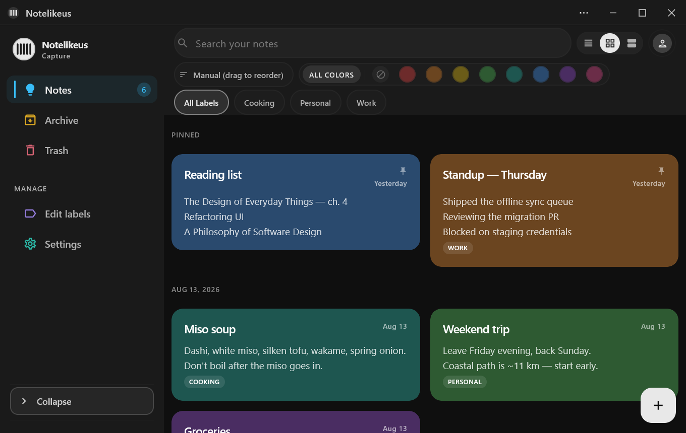

# Notelikeus

A Keep-style notes app for Android, Windows and the browser. Notes are written to local storage first; signing in is optional and only adds sync on top.

Android and Windows share a Kotlin Multiplatform core with a Compose UI. The web client is a separate React PWA that talks to the same Supabase schema.

- Web app: <https://notelikeus-dev.pages.dev>
- Current version: [1.0.3](https://github.com/shareef01/notelikeus/releases/tag/v1.0.3)
- Backend details: [docs/BACKEND_ARCHITECTURE.md](docs/BACKEND_ARCHITECTURE.md)

## Screenshots

**Windows**



**Web**

 

**Android**

   

## Features

| | Android | Windows | Web |
|---|:---:|:---:|:---:|
| Notes, labels, checklists, colours | ✓ | ✓ | ✓ |
| Pin, archive, trash, search, filters | ✓ | ✓ | ✓ |
| List / grid / compact layouts | ✓ | ✓ | ✓ |
| Rich text (bold, italic, links, bullets) | ✓ | ✓ | ✓ |
| Multi-select and bulk actions | ✓ | ✓ | ✓ |
| Swipe actions with undo | ✓ | ✓ | ✓ |
| Manual reorder in list view | ✓ | ✓ | ✓ |
| Image attachments | ✓ | ✓ | ✓ |
| Theme, accent, pure black | ✓ | ✓ | ✓ |
| Reminders | Notifications | Tray, while the app runs | Service worker |
| Encrypted local database | SQLCipher | — | — |
| Biometric app lock | ✓ | — | — |
| Home-screen widget | Glance | — | — |
| Google sign-in and cloud sync | Optional | Optional | Optional |
| Usable with no account | ✓ | ✓ | ✓ |
| JSON backup import / export | ✓ | ✓ | ✓ |
| Installable PWA | — | — | ✓ |

## How it works

Notes are stored on the device. Android and Windows use Room; on Android the database is encrypted with SQLCipher under a key held in the Android Keystore. The web client keeps notes in IndexedDB, for guests and signed-in users alike. Nothing about the app requires an account.

Sync sits above that. When you sign in, notes replicate through Supabase: Postgres RPCs for mutations, Realtime as a wake-up signal, row-level security for isolation.

Conflicts resolve on a server-assigned revision rather than a client clock, so a device with a skewed clock cannot overwrite a revision the server has already confirmed. Deletions travel as tombstones, so a note deleted on one device stays deleted when another device syncs later.

A cloud read that fails is not treated as an empty account. A fetch returning nothing where notes were expected refuses the sync rather than concluding everything was deleted.

Saved locally and synced are reported as different things. An edit counts as saved once Room or IndexedDB has taken it; a later network failure shows as sync pending, not as a lost note. If the local write itself fails, the editor stays open holding the text and offers a retry.

Attachments are written to durable local storage before the note references them, so a note that points at an image still has the bytes after a restart and the upload can resume. Blobs live in Cloudflare R2 behind a Worker that verifies the Supabase session and derives the object key from the authenticated user. Staged bytes are scoped to the account that created them.

Importing a JSON backup adds its notes as new notes rather than replacing what is on the device, so importing the same file twice gives you two copies. The format carries note content, not attachments.

## Stack

| Layer | Android / Windows | Web |
|---|---|---|
| UI | Compose Multiplatform | React 19, TypeScript, Tailwind |
| Structure | MVVM with shared repositories | Hooks and Zustand stores |
| Local data | Room, SQLCipher on Android | IndexedDB |
| Cloud | Supabase Auth, Postgres RPC, Realtime | Supabase Auth, Postgres RPC, Realtime |
| Attachments | Cloudflare Worker and R2 | Cloudflare Worker and R2 |
| Hosting | MSI installer | Cloudflare Pages |
| Tooling | Koin, Coroutines, Flow | Vite, Vitest, Playwright |

## Getting started

Android 8.0 (API 26) is the minimum supported release, and the desktop build ships as a
Windows MSI. Building needs JDK 17 for the Kotlin targets and Node.js 24 for the web app;
the database suite needs Docker for the Supabase CLI.

```bash
npm install
npm run supabase:start
npm run supabase:reset
```

### Android

Google sign-in on a device needs a hosted Supabase URL compiled into the APK; debug builds do not fall back to localhost. `npm run setup:staging` writes the gitignored `web/.env.staging` that the next command reads.

```bash
npm run kotlin:staging-properties
./gradlew :androidApp:assembleDebug
```

See [docs/ANDROID_STAGING.md](docs/ANDROID_STAGING.md) for the keys involved.

### Windows

```bash
./gradlew :composeApp:run          # run from source
./gradlew :composeApp:packageMsi   # build the installer
```

### Web

```bash
cd web
npm install
cp .env.example .env
npm run dev
```

Production builds need a hosted `VITE_SUPABASE_URL` and the public `VITE_SUPABASE_ANON_KEY`.

## Testing

| Suite | Covers | Command |
|---|---|---|
| Kotlin unit | Sync engine, mappers, repositories, backup, key management, Room migrations | `./gradlew :composeApp:testDebugUnitTest :composeApp:desktopTest :androidApp:testDebugUnitTest` |
| Instrumented | Database quarantine and encryption migration, on a device | `./gradlew :composeApp:connectedDebugAndroidTest` |
| Minified release | R8 and resource shrinking | `./gradlew :androidApp:assembleRelease` |
| Web unit | Merge logic, conflict resolution, backup parsing, search | `cd web && npm test` |
| Web end-to-end | Built bundle in Chromium against local Supabase | `cd web && npm run test:e2e` |
| Database | RLS, sync RPCs, tombstones, attachments (pgTAP) | `npm run supabase:test` |
| Attachments Worker | JWT auth, path isolation, size and MIME limits | `npm run test:attachments-worker` |
| Pages artifacts | `_headers` and `_redirects` in `web/dist` | `npm run pages:verify` |

The instrumented suite needs a connected device or emulator; the database and end-to-end suites need a running local Supabase (`npm run supabase:start`).

## Repository layout

| Path | Contents |
|---|---|
| `androidApp/` | Android application module: manifest, AppFunctions, widget metadata |
| `composeApp/` | Shared Kotlin Multiplatform UI, domain, Room, and the Windows desktop target |
| `web/` | React PWA |
| `supabase/` | Postgres migrations, seed data, pgTAP tests |
| `workers/attachments/` | Cloudflare Worker for R2 authorization |
| `cloudflare/` | Pages header parity check |
| `docs/` | Architecture, design decisions, known defects, device QA |
| `store/` | Play Store listing copy and publishing notes |

## Privacy

Guest notes never leave the device. Signed-in notes sync to your own Supabase account, protected by row-level security and authorized RPCs rather than end-to-end encryption. There is no analytics or tracking SDK in any client. See [PRIVACY_POLICY.md](PRIVACY_POLICY.md).

## Maintainer

Built and maintained by [@shareef01](https://github.com/shareef01). Issues and pull requests are welcome; see [CONTRIBUTING.md](CONTRIBUTING.md) and [SECURITY.md](SECURITY.md).

## License

All rights reserved. No licence is granted for reuse or redistribution.
