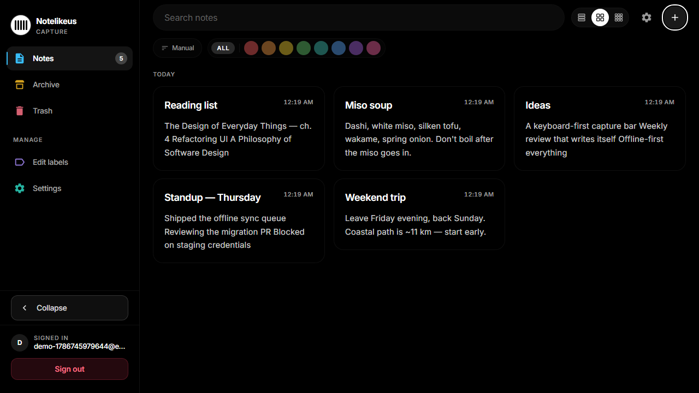
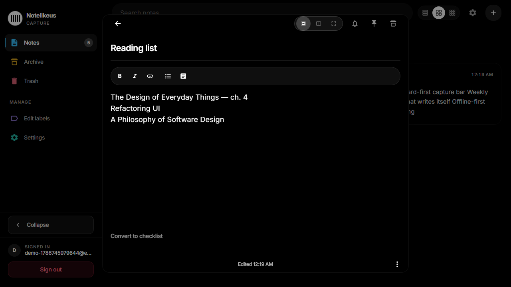
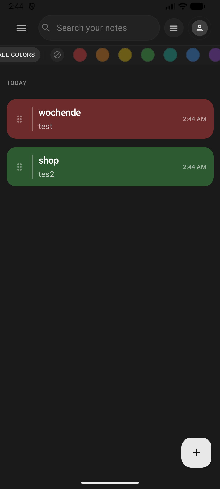
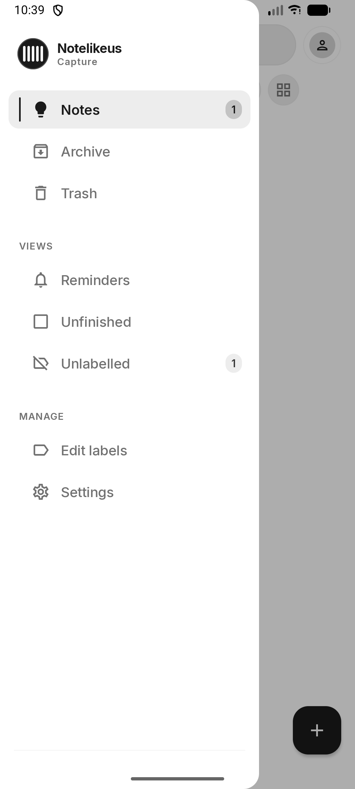
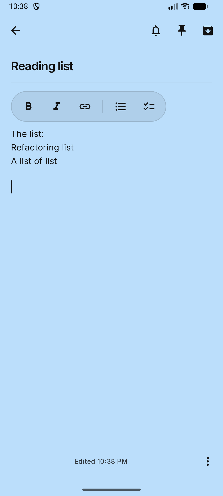
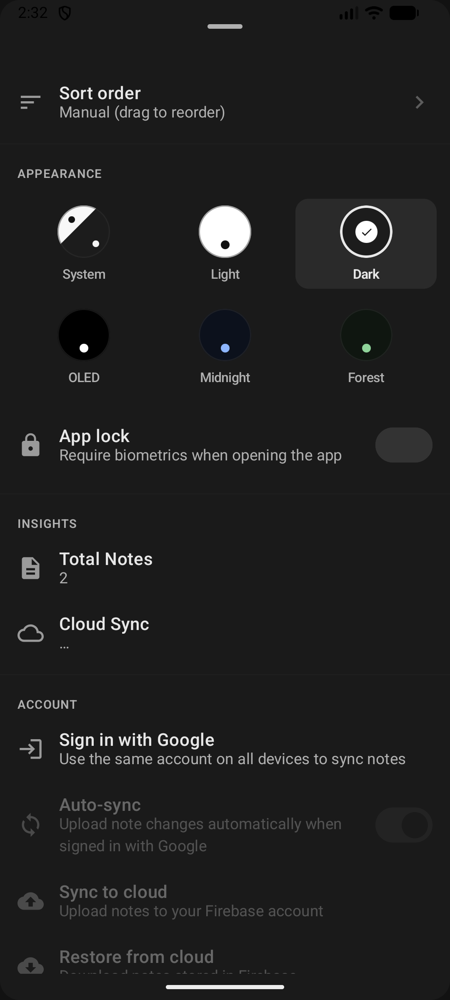

# Notelikeus

A notes app for **Android**, **Windows**, and the **web** — one product, three real clients, sharing a Kotlin Multiplatform core and a React PWA that speaks the same data model.

It started as the app I actually wanted to use: something as quick as Google Keep, that works with no signal and no account, and that doesn't hold my notes hostage in one vendor's cloud. Everything here follows from that — local storage first, sync as an optional layer on top, and a backup format I can read without the app.

**Live web app:** [notelike.web.app](https://notelike.web.app)

---

## Screenshots

### Windows

<p align="center">
  
</p>

### Web

<p align="center">
  
  
</p>

### Android

<p align="center">
  
  
  
  
</p>

---

## How it works

**Notes live on the device first.** Android and Windows use Room; on Android the database is encrypted with SQLCipher, keyed from the AndroidKeystore. Sync is a layer above that, not a prerequisite — sign in and your notes replicate through Firestore, or don't and the app is still fully usable offline.

**The web client is Firestore-native** when you are signed in, with the SDK's offline cache doing the same job the Room database does elsewhere. You can also continue without an account: notes stay in that browser until you sign in or export a backup. There is a PWA install path and service-worker reminders.

**Conflicts resolve on a server timestamp**, not a client clock. A device with a skewed clock — or an imported backup with a hand-edited timestamp — can't overwrite a revision the server has already confirmed. Deletions propagate as tombstones with a TTL, so a note deleted on one device stays deleted rather than being resurrected by another device syncing later.

**Reads that fail open are treated as suspect.** A cloud fetch returning nothing when notes were expected refuses the sync rather than concluding everything was deleted, on every client. That guard exists because the alternative is silent, unrecoverable data loss.

---

## Features

| | Android | Windows | Web |
|---|:---:|:---:|:---:|
| Notes, labels, checklists, colours | ✓ | ✓ | ✓ |
| Pin, archive, trash, search, filters | ✓ | ✓ | ✓ |
| List / grid / compact layouts | ✓ | ✓ | ✓ |
| Multi-select + bulk actions | ✓ | ✓ | ✓ |
| Swipe actions + undo | ✓ | ✓ | ✓ |
| Manual reorder (list view) | ✓ | ✓ | ✓ |
| Date-grouped sections | ✓ | ✓ | ✓ |
| Collapsible side rail (persisted) | — (drawer) | ✓ | ✓ |
| Themes (light, dark, OLED, midnight, forest, auto) | ✓ | ✓ | ✓ |
| Rich text (bold, italic, links, bullets) | ✓ | ✓ | ✓ |
| Reminders | System notifications | Tray (missed ones surface at next launch) | Service worker |
| Encrypted local database | ✓ SQLCipher | — | — |
| Biometric app lock | ✓ | — | — |
| Home-screen widget | ✓ Glance | — | — |
| Google sign-in + Firestore sync | Optional | Optional | Optional |
| Works with no account | ✓ | ✓ | ✓ |
| JSON backup import / export | ✓ | ✓ | ✓ |
| Installable PWA | — | — | ✓ |

---

## Stack

| Layer | Android / Windows | Web |
|---|---|---|
| UI | Compose Multiplatform | React 19, TypeScript, Tailwind |
| Architecture | MVVM + repositories (shared) | Hooks + Zustand stores |
| Local data | Room (SQLCipher on Android) | Firestore offline cache |
| Cloud | Firebase Auth + Firestore | Firebase Auth + Firestore |
| DI / tooling | Koin, Coroutines, Flow | Vite 8, Vitest |
| Widget | Glance | — |

Firebase usage is deliberately scoped to Auth and Firestore so the whole thing runs inside the **Spark** free tier.

---

## Testing

Roughly 250 automated checks, arranged so that each one can actually fail:

| Suite | Covers | Run with |
|---|---|---|
| JVM unit (~200) | Sync engine, mappers, repositories, backup, key management | `./gradlew :composeApp:testDebugUnitTest :composeApp:desktopTest` |
| Minified release APK | R8 + resource shrink; unsigned in CI | `./gradlew :androidApp:assembleRelease` |
| Instrumented (4) | Database quarantine and encryption migration, on a real device | `./gradlew :composeApp:connectedDebugAndroidTest` |
| Firestore rules (34) | Security rules against the emulator | `npm run test:rules` |
| Web unit (263) | Merge logic, conflict resolution, backup parsing, search | `cd web && npm test` |
| Web sync (6) | The sync layer against a live Firestore, production rules enforced | `cd web && npm run test:sync` |
| Browser end-to-end (4) | The built bundle in Chromium: boot, auth, note round-trip | `cd web && npm run test:e2e` |

The last three run against Firebase emulators in CI. Android CI also minifies a release APK on every PR so an R8 keep-rule break cannot wait for a tag. The instrumented suite needs a connected device or emulator.

A note on why the split matters: the unit tests are all pure functions, so they'd happily pass while the app was broken in a browser. The emulator and end-to-end suites exist to cover exactly that gap — a Firebase SDK major upgrade landed cleanly because the browser suite could prove the built bundle still ran.

---

## Requirements

- Android 8.0+ (API 26) / Windows 10+
- JDK 17+ to build; JDK 21+ for the Firestore rules tests
- Node.js 24 LTS for the web app and emulator suites

## Getting started

```bash
# Android
./gradlew :androidApp:assembleDebug

# Windows
./gradlew :composeApp:run

# Web
cd web && npm install
cp .env.example .env     # fill in your own Firebase web app config
npm run dev
```

The Firebase values in `.env.example` are placeholders — point it at your own project. Firestore rules live in `firestore.rules` and are covered by `npm run test:rules`.

---

Built and maintained for my own daily use. It's a real app rather than a demo, which is the interesting part and also the reason some of it is more careful than a side project strictly needs to be.

## License

Private project — all rights reserved unless otherwise noted.
