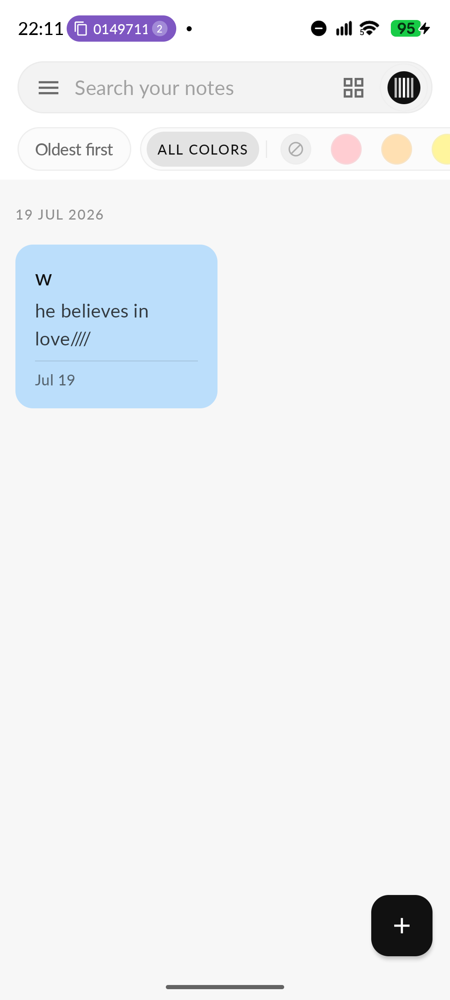
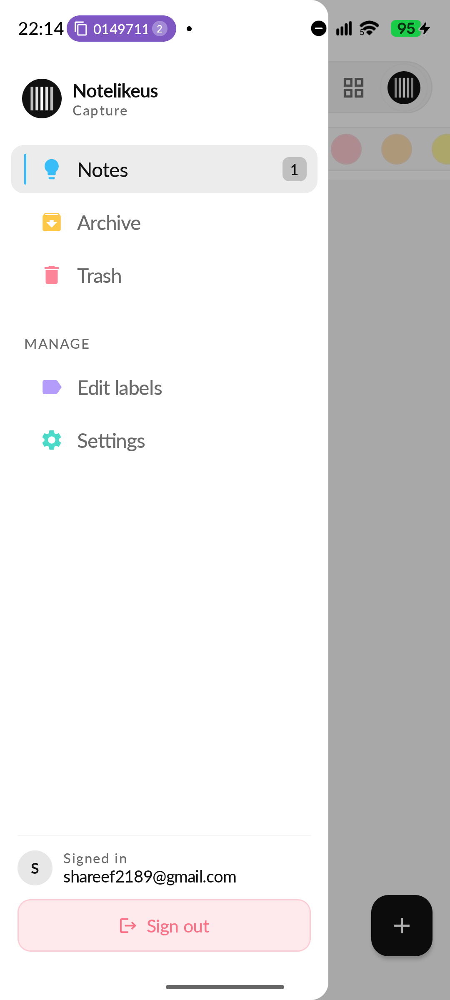
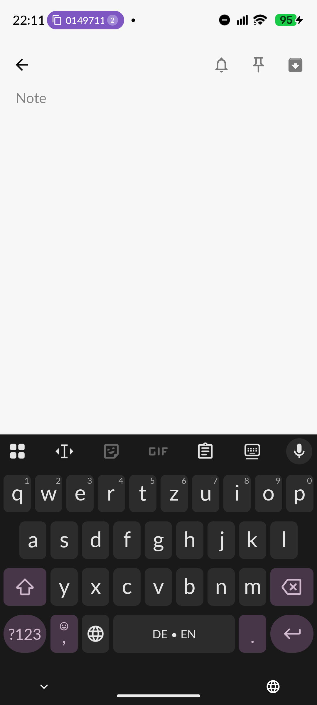

# Notelikeus

A portfolio-ready notes app for **Android**, **Windows (Desktop)**, and the **web** (PWA), inspired by the speed and simplicity of Google Keep.

**Live web app:** [https://notelike.web.app](https://notelike.web.app)

> Note: the web app requires Google Sign-In because notes are stored per-user in Firestore.

- **KMP (Android & Windows)** — offline-first: notes live in an SQLCipher-encrypted Room database. Google Sign-In is optional; when signed in, notes sync to Firestore (auto-sync can be toggled in Settings).
- **Web** — Google Sign-In required. Notes live in Firestore with offline caching and installable PWA support.

## What I built

- A multiplatform notes app for **Android**, **Windows**, and **web/PWA**
- Refactored from native Android to **Kotlin Multiplatform (KMP)** and **Compose Multiplatform**
- An offline-first experience with encrypted local storage (SQLCipher on Android/Desktop)
- A Firebase-backed sync flow designed to stay within the **Spark** plan
- Shared core product features across clients: labels, reminders, backup, theming, and sync
- Production-style UX hardening around auth, offline recovery, and destructive actions

## Engineering highlights

- **Kotlin Multiplatform migration**: Shared business logic, database, and UI across Android and Desktop using CMP and Koin.
- **Offline-first architecture** using Room + SQLCipher, with sync layered on top rather than required for basic use.
- **Spark-plan-conscious Firebase design** using Auth + Firestore only, with legacy attachment support removed from active product flow.
- **Cross-platform product parity** across Android, Desktop, and React PWA for core note workflows.
- **Safer destructive actions** with stronger sign-out and cloud-delete confirmations.

Notelikeus is maintained primarily for **personal use** and as a **portfolio piece**, rather than for Play Store launch readiness.

## Overview

Current screenshots from the app are shown below.

### Android
<p align="center">
  
  
  
</p>

## Highlights

- Shared product direction across **native Android**, **Windows**, and **web/PWA**
- Secure local-first storage with **Room + SQLCipher**
- Optional Google sign-in on Android/Desktop, required auth on web for clean sync boundaries
- Firestore sync designed to stay within the **Firebase Spark** plan
- Import/export support using an Android-compatible JSON backup format
- UX hardening around sign-out, offline recovery, boot failures, and reminder expectations

## Features

| | Android | Windows | Web |
|---|:---:|:---:|:---:|
| Notes, labels, checklists, colors | ✓ | ✓ | ✓ |
| Pin, archive, trash, search, filters | ✓ | ✓ | ✓ |
| List / grid / compact layouts | ✓ | ✓ | ✓ |
| Multi-select + bulk actions | ✓ | ✓ | ✓ |
| Swipe actions + undo | ✓ | ✓ | ✓ |
| Manual reorder (list view) | ✓ | ✓ | ✓ |
| Date-grouped sections | ✓ | ✓ | ✓ |
| Themes (light, dark, OLED, midnight, forest, auto) | ✓ | ✓ | ✓ |
| Theme-aware note color palette | ✓ | ✓ | ✓ |
| Rich text (bold, italic, links, bullets) | ✓ | ✓ | ✓ |
| Reminders | System notifications | System notifications | Browser / service worker |
| Encrypted local database (SQLCipher) | ✓ | ✓ | — |
| Optional biometric app lock | ✓ | ✓ (Hello) | — |
| Home-screen widget | ✓ | — | — |
| Google Sign-In + Firestore sync | Optional | Optional | Required |
| JSON backup import / export | ✓ | ✓ | ✓ |
| Installable PWA | — | — | ✓ |

## Architecture and stack

| Layer | Android / Windows | Web |
|-------|---------|-----|
| UI | Compose Multiplatform | React 19, TypeScript, Tailwind |
| Architecture | MVVM + Repositories (Shared) | Hooks + Zustand stores |
| Local data | Room + SQLCipher (Shared) | Firestore offline cache |
| Cloud | Firebase Auth + Firestore | Firebase Auth + Firestore |
| DI / tooling | Koin, Coroutines, Flow | Vite, Vitest |
| Widget | Glance (Android only) | — |
| Tests | JUnit, Turbine, MockK | Vitest, Playwright smoke |

## Requirements

- Android 8.0+ (API 26) / Windows 10+
- Android Studio Ladybug or newer
- **JDK 17+** to build the mobile/desktop app
- **JDK 21+** for Firestore rules unit tests (`npm run test:rules`)
- Node.js 20 LTS (web + rules tests)

## Getting started

### Android & Desktop

```bash
./gradlew :androidApp:assembleDebug
./gradlew :composeApp:desktopRun
```

### Web

```bash
cd web
npm install
cp .env.example .env   # set VITE_FIREBASE_APP_ID
npm run dev
```

## License

Private project — all rights reserved unless otherwise noted.
